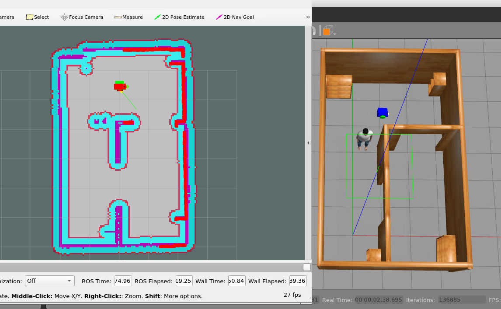

# Home_Service_Robot

## Description

This project contains a home service robot capable of executing SLAM, as well as navigating to pre-defined goal points to pick up/drop off objects (cube).

## Methodology

Concepts explored in this project:

* Gmapping RGB-D SLAM
* ROS navigation stack
* AMCL  


## Getting Started

To get started, you need to have ROS-Noetic.

First, create your own catkin workspace and clone this repository under `src`  folder

```shell
$ mkdir -p catkin_ws/src && cd catkin_ws/src
$ catkin_init_workspace
```

Next, compile all the ROS packages under the root directory: 

```shell
$ catkin_make
$ source devel/setup.bash
```

And navigate to the `scripts` directory:

```shell
$ cd src/scripts
```

### Part 1: SLAM

The first thing the robot can do is SLAM. To perform SLAM, run the `test_slam.sh`script:

```shell
$ ./test_slam.sh
```

To operate the robot, click on the window for the `keyboard_teleop` node, and follow the commands there. As the robot moves around the world, the map will begin to appear in Rviz.

Save the map using command " rosrun map_server map_saver -f mymap " with name of map = mymap

### Part 2: Navigation

The next task for the robot is navigation. To test the robot's navigation, run the `test_navigation.sh` script:

```shell
$ ./test_navigation.sh
```

In Rviz, Click the "2D Nav Goal" button and click anywhere on the map to command the robot. 


### Part 3: Home Service

To move the robot to pre-difined points, run the `home_service.sh` script:

```shell
$ ./home_service.sh
```

An object (green cube) will show up in Rviz at pick up location. The robot will navigate to the object and then to the drop off location. 




